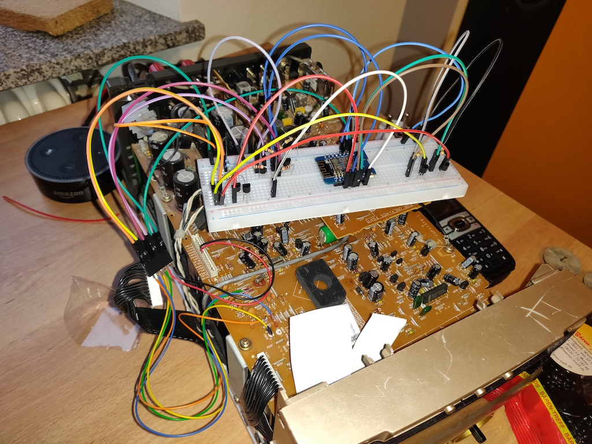
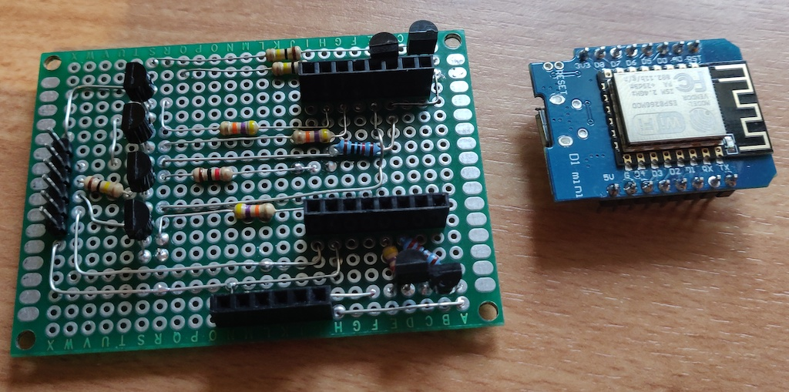

# Teac CR-H130 controller
Okay so you got a Teac CR-H130. You like the sound, and you don't want to replace it. 
But you want to remote control it with your smart home system. What do you do? 

Yep, you could emulate the IR signals from the remote control - mine was dead, no way to retrieve the codes 
(yes I could have bought a new one - but everyone can 'buy').
So I tried to emulate the buttons with an ESP8266. 
As I only use the AUX input, I just need on/off and volume up and down.

## Digging into CR-H130
The volume knob is a normal rotary encoder, the power button is just a button.
All buttons are pulled up to a certain voltage (forgot which). A button press pulls the line to GND.
To emulate button presses, one can use a NPN to programmatically pull the lines to GND.
After hooking everything up fo test, it looked like that:

As the CD changer in my CR-H130 is dead, too, I previously unplugged it (the black connector on the left) 
to stop the machine from trying to initialize the changer (which resulted in strange noise).
This way I can use the power supply for the changer to power the ESP.

As the breadboard is not really pretty, I soldered everything to a piece of perfboard and used some pin headers to make the ESP pluggable.

(The pin header on the bottom was for powering some unrelated stuff... just ignore it)